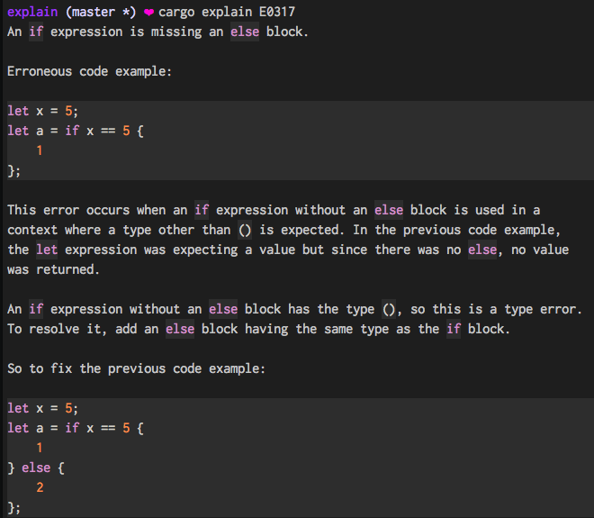

# cargo explain

A replacement for `rustc --explain` that syntax highlights
Rust code snippets for easier reading.

## Usage

Run `cargo install cargo-explain` to install as a Cargo subcommand.

Invoke with `cargo explain <error code>` (`cargo explain --explain <error code>` is also recognized)
